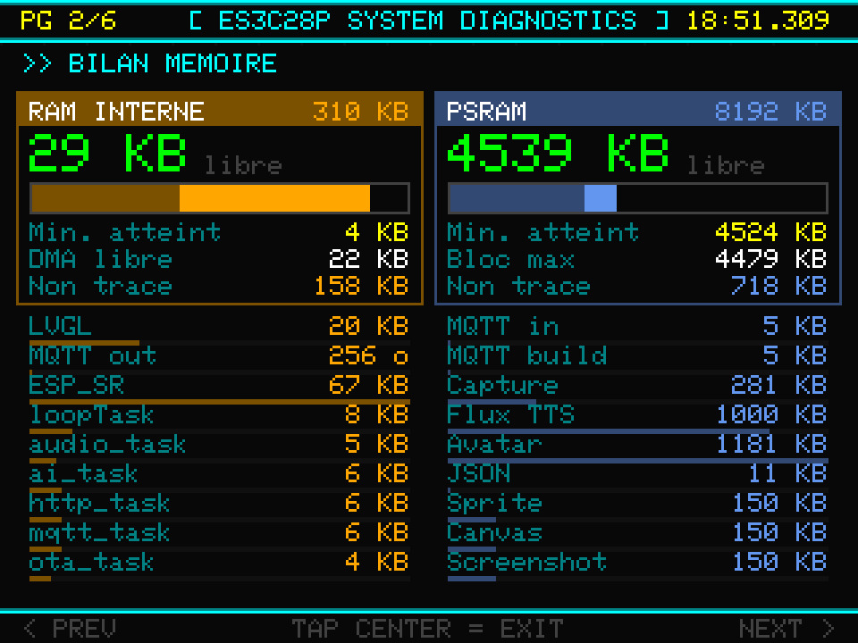
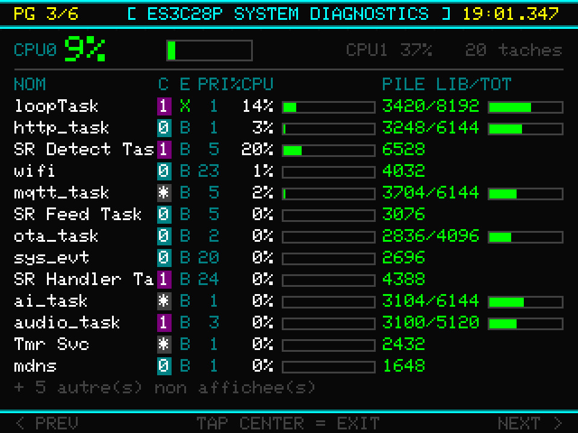
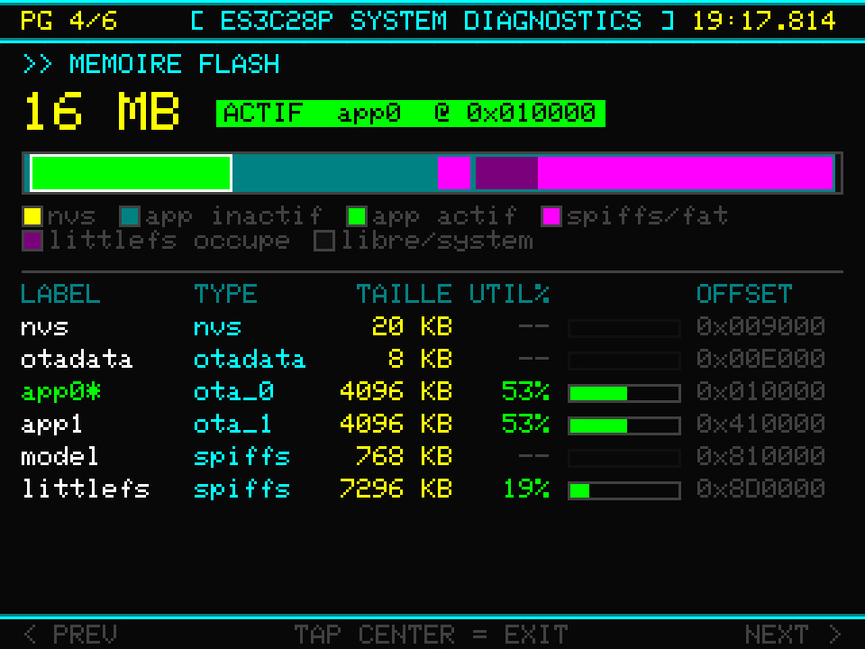
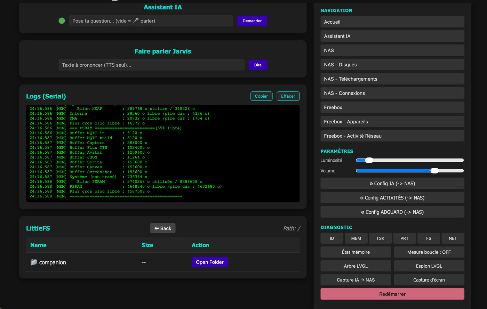

# Dashboard ESP32-S3 — README

## Description

Dashboard embarqué pour ESP32-S3 (ES3C28P) affichant en temps réel des métriques issues de :
- NAS Synology DS1522+
- Freebox (API Freebox OS)

Le projet est basé sur une architecture MQTT modulaire :
- `synology/` collecte les données via des scripts Python
- `synology/compose.yaml` lance un container Python central
- `esp32/` lit les topics MQTT et affiche les informations sur un écran ILI9341 via LVGL

Assistant IA de bureau via groq
- Déclenchement par le mot clef 'Jarvis' (ESP_SR)
- requêtes/réponses en vocales et textes
- Lecture de flux RSS météo et actualités paramètrables

---

## Hardware

| Composant     | Référence         |
|---------------|-------------------|
| Module        | LCDWIKI ES3C28P   |
| MCU           | ESP32-S3 N16R8    |
| Écran         | 2.8" IPS ILI9341V |
| Touch         | FT6336G (I2C)     |
| Audio         | ES8311 + FM8002E  |
| Micro         | MEMS LMA2718B     |
| LED           | WS2812B           |

---

## Architecture

```
Synology DS1522+
  ├── Docker : Mosquitto (MQTT broker) + python slim 3.12
  ├── Docker : monitor.py        → publie nas/# et freebox/#
  ├── Docker : nas_monitor.py    → métriques NAS
  ├── Docker : freebox_monitor.py → métriques Freebox
  └── Docker : bridge_monitor.py → companion IA  

ESP32-S3 (ES3C28P)
  ├── WiFi → MQTT → Synology
  ├── esp_lcd + LVGL 9.x → ILI9341 (affichage)
  ├── FT6336G (touch I2C 400KHz)
  └── ES8311 (audio)
```

---

## État actuel (par ordre d'implémentation)

- ✅ Collecte des métriques NAS via `nas_monitor.py`
- ✅ Collecte des métriques Freebox via `freebox_monitor.py`
- ✅ Broker MQTT Mosquitto en container
- ✅ Interface graphique LVGL 9.x sur ESP32 via `esp_lcd` (pilote ILI9341 maison, `display_driver.cpp`)
- ✅ Gestion du tactile FT6336G (I2C 400KHz)
- ✅ Écran tableau générique dynamique (disques, downloads, connexions, appareils Freebox)
- ✅ Réglage luminosité backlight via slider tactile
- ✅ Réglage du volume via slider tactile
- ✅ Écran de diagnostic système (SysInfo) — identité chip, mémoire, réseau, tâches FreeRTOS, partitions flash, système de fichiers LittleFS (6 pages)
- ✅ Audio ES8311 + I2S (sons d'interface, fanfare, test loopback micro/haut-parleur) — tourne sur une tâche FreeRTOS dédiée (cœur 1)
- ✅ LED WS2812B — indicateur d'état (WiFi/MQTT/enregistrement audio)
- ✅ Mise à jour OTA (ArduinoOTA) — tâche dédiée, avec écran de progression
- ✅ Assistant IA (écran Companion) — enregistrement vocal (coupure sur silence), upload direct du buffer PSRAM vers un bridge HTTP (STT/LLM/TTS),
     lecture de la réponse audio et affichage question/réponse. Déclenchement également possible en texte via MQTT (`ai/ask`)
- ✅ Interface web embarquée (port 80, `http_manager.cpp`) : gestionnaire de fichiers LittleFS (liste/téléchargement/suppression), visualiseur de logs circulaire (`GET /serial`), panneau de commandes ESP32
- ✅ Assistant IA — outils appelés par le LLM lui-même (function calling) : **météo** (Open-Meteo ; prévisions demain / semaine, conditions décodées),
     **actualités** (flux RSS résumés à l'oral) et **recherche web** (DuckDuckGo) ;
     page de config web à chaud (`http://<NAS>:8090/`) : voix, personnalité, modèle, météo, actualités, commandes vocales
- ✅ Détection par mot-clé (wake word) « Jarvis » via ESP_SR natif (`wakeword_manager.cpp`) — déclenche l'assistant IA sans appui bouton, en plus du bouton Rec et de MQTT
- ✅ Écran « Activité réseau » — service en cours par appareil (YouTube, Steam…) déduit du journal DNS d'AdGuard Home (`activity_monitor.py`, port 8091)
- ✅ Commandes `esp32/cmd` (navigation à distance, luminosité, volume, reboot, outils de diagnostic) pleinement exécutées via `mqtt_handle_esp_cmd()` — appelable depuis le topic MQTT `esp32/cmd` 
     ou depuis la colonne de commandes de la page web (`POST /cmd`)
- ✅ Commandes vocales — une phrase contenant un mot-clé de pilotage (« pilote… ») est traduite en action `esp32/cmd` par le LLM ;
     les réglages (volume, luminosité) demandent une confirmation vocale, la navigation s'exécute directement


---

## Structure du dépôt

```
dashboard-projet/
├── README.md                        # Ce fichier
├── LICENSE                          # Licence GPLv3
├── .gitignore                       # Exclut les secrets (config.h, monitor.env, ota.local.ini…)
├── 3D/
│   ├── Arrière.3mf                # Impression 3D — coque arrière
│   ├── Avant.3mf                  # Impression 3D — coque avant
│   └── ES3C28P case.f3d           # Source Fusion 360
├── docs/
│   ├── img/                       # Captures d'écran (galerie du README)
│   ├── ES3C28P.md                 # Pinout complet du module
│   ├── ES3C28P_ES2N28P_Specification_V1.0.pdf
│   ├── ES8311.user.Guide.pdf      # Datasheet codec audio
│   ├── mqtt_topics.md             # Description des topics MQTT
│   ├── Scripts_tests.md           # Notes de tests et scripts utiles
│   └── multinet_srmodels.md       # Construction du srmodels.bin (ESP-SR / MultiNet)
├── esp32/
│   ├── platformio.ini             # Configuration pioarduino (extra_configs → ota.local.ini)
│   ├── partitions.csv             # Table de partitions 16MB (app0/app1/model/littlefs)
│   ├── model/                     # srmodels_jarvis.bin — modèle ESP-SR du wake word
│   ├── data/                      # Contenu de LittleFS (sprites de l'avatar Companion)
│   ├── extra_scripts/             # Scripts de build (flash du modèle ESP-SR + LittleFS, png→bin et bin→png)
│   ├── include/                   # Headers bas niveau
│   │   └── lv_conf.h              # Configuration LVGL
│   ├── squareline/
│   │   └── ui/                    # Sources générées Squareline Studio 1.6.1
│   │       ├── screens/           # Un fichier .c/.h par écran
│   │       │   ├── ui_ScreenHome.c / .h
│   │       │   ├── ui_ScreenNAS.c / .h
│   │       │   ├── ui_ScreenFreebox.c / .h
│   │       │   ├── ui_ScreenTable.c / .h
│   │       │   └── ui_ScreenAI.c / .h
│   │       ├── ui_events.c / .h   # Callbacks événements
│   │       ├── ui_helpers.c / .h
│   │       ├── ui.c / .h
│   │       └── dashboard.spj      # Projet Squareline Studio (+ .sll / .slp / project.info)
│   └── src/
│       ├── config.h.example       # Modèle de config (config.h réel = hors dépôt, secrets WiFi/OTA)
│       ├── main.cpp
│       ├── ai_companion.cpp / .h      # Sprites/état visuel de l'écran Companion
│       ├── ai_manager.cpp / .h        # Assistant IA — bridge HTTP (STT/LLM/TTS), état Companion
│       ├── audio_manager.cpp / .h     # ES8311 + I2S + FM8002E
│       ├── display_driver.cpp / .h    # Dalle ILI9341 sur esp_lcd — seul propriétaire du bus SPI
│       ├── display_gfx.cpp / .h       # Rastériseur logiciel RGB565 (dessin hors-écran)
│       ├── display_manager.cpp / .h   # LVGL, tableaux dynamiques, graphiques
│       ├── http_manager.cpp / .h      # Serveur web : fichiers LittleFS, logs, commandes ESP32
│       ├── led_manager.cpp / .h       # WS2812B — indicateur d'état
│       ├── littlefs_manager.cpp / .h  # Montage LittleFS + accès fichiers génériques
│       ├── log_manager.cpp / .h       # Journal circulaire (remplace Serial.print*)
│       ├── mqtt_manager.cpp / .h      # Client MQTT, réception topics
│       ├── ota_manager.cpp / .h       # Mise à jour OTA (ArduinoOTA)
│       ├── sysinfo_manager.cpp / .h   # Écran diagnostic système
│       ├── touch_manager.cpp / .h     # FT6336G I2C
│       ├── wakeword_manager.cpp / .h  # Mot-clé « Jarvis » (ESP-SR)
│       └── wifi_manager.cpp / .h      # Connexion WiFi
└── synology/
    ├── Dockerfile               # Dépendances Python (installées à l'image)
    ├── compose.yaml             # Container Python central + Mosquitto
    ├── monitor.env.example     # Modèle (monitor.env réel = hors dépôt : secrets NAS/Freebox/Groq/AdGuard)
    ├── monitor.py               # Orchestrateur des scripts
    ├── scripts/
    │   ├── nas_monitor.py       # Collecte métriques NAS DSM
    │   ├── freebox_monitor.py   # Collecte métriques Freebox OS
    │   ├── bridge_monitor.py    # Assistant IA — bridge HTTP (STT/LLM/TTS + météo/actus)
    │   ├── bridge_defaults.json # Défauts des paramètres IA (versionné)
    │   ├── bridge_settings.json # Overrides sauvés par la page config (hors repo)
    │   ├── freebox_get_token.py # Générateur d'API_TOKEN Freebox
    │   ├── activity_monitor.py  # Activité réseau — lit le journal DNS AdGuard (port 8091)
    │   └── services.json        # Mapping domaine → service (éditable à chaud)
    └── mosquitto/
        ├── mosquitto.conf       # conf serveur MQTT
        ├── data/                # data serveur MQTT (inutilisés)
        └── log/                 # logs serveur MQTT (inutilisés)
```

---

## Prérequis

- Synology DS1522+ avec accès SSH ou dossier Docker
- Freebox v8 avec accès API Freebox OS
- ESP32-S3 compatible (carte `esp32-s3-devkitc-1`)
- pioarduino (fork de PlatformIO) (framework-arduinoespressif32 @ 3.3.9 nécessaire pour ESP_SR, le WakeWord) 
- Broker MQTT accessible depuis le NAS et l'ESP32

---

## Configuration

### 1. Configurer le monitor Synology

Copiez le modèle puis renseignez vos valeurs :

```bash
cp synology/monitor.env.example synology/monitor.env
```

Éditez `synology/monitor.env` et renseignez au moins :

- `NAS_HOST`            -> IP du Nas Synology
- `NAS_PORT`            -> Port du Nas Synology
- `NAS_USER`            -> User du Nas Synology
- `NAS_PASSWORD`        -> MDP de USER sur le Nas Synology
- `MQTT_BROKER`         -> IP du Nas Synology
- `FREEBOX_HOST`        -> IP de la Freebox
- `APP_TOKEN`           -> Token générée par le script synology/scripts/freebox_get_token.py
- `GROQ_API_KEY`        -> votre API_KEY groq https://console.groq.com/home
(Tout en fait !)

> Ne stockez jamais vos identifiants secrets publiquement.

Les paramètres de l'assistant IA (voix, modèle, personnalité, météo, actualités, commandes vocales) ne sont **pas** dans `monitor.env` : leurs défauts vivent dans `synology/scripts/bridge_defaults.json` (versionné, sans secret) et se modifient à chaud depuis la page `http://<NAS>:8090/`. `bridge_settings.json` garde les réglages sauvés côté NAS (hors dépôt).

L'écran **« Activité réseau »** (voir plus bas) s'appuie sur [AdGuard Home](https://adguard.com/adguard-home.html) installé sur le NAS comme résolveur DNS du réseau : renseignez `AGH_URL` / `AGH_USER` / `AGH_PASS` dans `monitor.env`. Le service `activity_monitor.py` interroge son journal DNS (page servie sur le port `8091`). Sans AdGuard, tout le reste fonctionne — seule la colonne « service » reste vide.

### 2. Lancer le container de monitoring

```bash
cd synology
docker compose up -d --build
docker compose logs -f
```
L'image Docker installe automatiquement les dépendances Python à la construction via `Dockerfile` 

### 3. Configurer l'ESP32

Ouvrez `esp32/` dans PlatformIO.

Copiez le modèle puis renseignez vos valeurs :

```bash
cp esp32/src/config.h.example esp32/src/config.h
```

Mettez à jour `esp32/src/config.h` avec :
- les identifiants WiFi (`WIFI_SSID`/`WIFI_PASSWORD`)
- l'adresse du NAS (`NAS_HOST`) — **à changer là et nulle part ailleurs** : l'adresse du broker MQTT et les cinq URL du bridge IA (`AI_BRIDGE_URL` pour l'audio, `AI_BRIDGE_TEXT_URL` pour le texte…) en découlent par concaténation, elles pointent vers le service HTTP `bridge_monitor.py` (STT/LLM/TTS) déployé avec le reste du monitoring sur le NAS (`synology/`, port 8090)
- le mot de passe OTA (`OTA_PASSWORD`)

Le mot de passe OTA n'est **pas** versionné dans `platformio.ini`. Créez un fichier `esp32/ota.local.ini` (ignoré par git, fusionné automatiquement par PlatformIO via `extra_configs`) avec la même valeur que `OTA_PASSWORD` de `config.h` :

```ini
[env:esp32s3]
upload_flags = --auth=votre_mdp_ota
```

Compilez et téléversez sur l'ESP32 depuis PlatformIO.

---

## Compilation et téléversement (PlatformIO CLI)

```bash
cd esp32
# Nettoyer le build
pio run -t clean
# Compilation
pio run
# Compilation + téléversement (firmware, et en USB : modèle ESP_SR + LittleFS)
pio run -t upload
# Monitor série
pio device monitor -b 115200
```

### Notes de compilation

**Un seul `upload` écrit tout (flash USB)** — `extra_scripts/flash_assets.py` ajoute le modèle ESP_SR (`model/srmodels_jarvis.bin`) et l'image LittleFS (construite depuis `data/`) à la liste des images passées à esptool, aux offsets lus dans `partitions.csv`. Ni `pio run -t uploadfs` ni un `esptool write-flash` manuel ne sont donc nécessaires. ⚠️ Sans ce script, la partition `model` reste vierge et **le wake word ne démarre pas, sans erreur explicite**.

**En OTA, seule la partition applicative est écrite** — c'est le fonctionnement normal d'`espota`, et le script se désactive alors de lui-même. Conséquence : **toute modification de `partitions.csv`, du contenu de `data/` ou du modèle ESP_SR impose un flash USB complet.**

**Premier flash (USB)** — dans `platformio.ini` : passer `upload_protocol = esptool` **et commenter `extra_configs`**, car `ota.local.ini` porte `upload_flags = --auth=…` qu'esptool ne connaît pas et qui le fait échouer. Vérifier dans le tableau d'esptool que les offsets de `model` et `littlefs` sont bien listés, puis ne revenir à `espota` (**en décommentant `extra_configs`**, sinon l'OTA part sans mot de passe et se fait refuser) qu'après avoir vérifié que « Jarvis » répond et que l'avatar s'anime.

**Client MQTT** — `mqtt_manager.cpp` utilise **esp-mqtt** (natif ESP-IDF, migré depuis PubSubClient en 07/2026) : réception/parsing sur sa propre tâche `mqtt_task`, hors `loop()`, le dispatch vers l'UI étant marshallé sur `loop()` par une file FreeRTOS. Les gros payloads JSON (notamment `freebox/devices`, > 4KB) sont absorbés par `cfg.buffer.size = 5120` (alloué en PSRAM) et un tampon de réassemblage PSRAM.

**Upload OTA par défaut** — `platformio.ini` est configuré avec `upload_protocol = espota` et `upload_port = Dashboard.local` : `pio run -t upload` téléverse donc par WiFi (ArduinoOTA) une fois le firmware initial flashé, sans câble. Pour le tout premier flash (ou en cas de perte de connexion WiFi), basculez temporairement sur `upload_protocol = esptool` avec le port série USB-C.

**Mot de passe OTA** — non versionné : à placer dans `esp32/ota.local.ini` (gitignoré, fusionné via `extra_configs = *.local.ini`). Sans ce fichier, l'upload OTA se fait sans authentification. ⚠️ La variable `${sysenv.OTA_PASSWORD}` ne convient pas : lancé depuis l'interface VS Code, PlatformIO n'hérite pas des `export` du shell.

---

## Écrans disponibles

<table>
  <tr>
    <td align="center"><br><sub><b>Accueil</b> — navigation + sliders</sub></td>
    <td align="center"><br><sub><b>NAS</b> — CPU/RAM, débits, graphiques</sub></td>
    <td align="center"><br><sub><b>Freebox</b> — débit, appareils, graphique</sub></td>
  </tr>
  <tr>
    <td align="center"><br><sub><b>NAS – Disques</b> — table SMART/statut/T°</sub></td>
    <td align="center"><br><sub><b>Companion IA</b> — assistant vocal « Jarvis »</sub></td>
    <td align="center"><br><sub><b>SysInfo 1/6</b> — identité, CPU, flash</sub></td>
  </tr>
  <tr>
    <td align="center"><br><sub><b>SysInfo 2/6</b> — bilan RAM interne / PSRAM</sub></td>
    <td align="center"><br><sub><b>SysInfo 3/6</b> — tâches FreeRTOS, %CPU, piles</sub></td>
    <td align="center"><br><sub><b>SysInfo 4/6</b> — carte de la flash 16 Mo</sub></td>
  </tr>
</table>

| Écran          | Description                                              |
|----------------|----------------------------------------------------------|
| Home           | Navigation principale + sliders luminosité backlight et volume |
| NAS            | CPU, RAM, temp, réseau, volume — graphiques temps réel   |
| Freebox        | Débit, IP publique, compteur appareils — graphique       |
| Table          | Tableau générique : disques / downloads / connexions / appareils Freebox |
| Activité réseau | Par appareil : service en cours (YouTube, Steam…) + débits DL/UP — via le journal DNS d'AdGuard Home |
| Companion (IA) | Assistant vocal : bouton Rec (enregistrement), bouton Play (rejouer la dernière réponse), sous-titres question/réponse |
| SysInfo        | Diagnostic système (6 pages, écran LVGL via canvas + buffer PSRAM hors-écran) : identité chip, mémoire, tâches FreeRTOS, partitions flash, système de fichiers LittleFS, réseau |

### Navigation tableau

Le bouton **Next** sur l'écran NAS ouvre le tableau des disques. Le bouton **Next** dans l'écran Table cycle entre les 4 sources. Le bouton **Back** revient à l'écran d'origine.

Les tableaux Disques et Freebox supportent le scroll horizontal pour accéder aux colonnes masquées (exemple : IP des clients connectés).

### Écran SysInfo

Accessible depuis le bouton dédié sur l'écran Home (`display_show_sysinfo()`). Chaque page est dessinée par le rastériseur `display_gfx` dans un buffer PSRAM hors-écran, puis copiée dans un `lv_canvas` affiché comme un écran LVGL normal (`lv_scr_load()`) — WiFi, MQTT et le reste de LVGL continuent de tourner normalement pendant l'affichage. Navigation tactile : zone gauche = page précédente, zone droite = page suivante, zone centrale = retour à l'UI LVGL. Un rappel de `display_show_sysinfo()` alors que l'écran est déjà affiché (commande `page:sysinfo` via MQTT ou la page web) fait avancer d'une page ; `page:sysinfo1` à `page:sysinfo6` ouvrent directement la page voulue.

### Écran Companion (IA)

Accessible depuis le bouton dédié sur l'écran Home. Fonctionnement :
- **Bouton Rec** : démarre l'enregistrement micro (coupure automatique après un silence prolongé, ou durée max définie par `AUDIO_RECORD_MAX_SECONDS`). Le buffer audio capturé reste en PSRAM et est uploadé directement en HTTP vers le bridge IA (`AI_BRIDGE_URL`), sans jamais transiter par la flash.
- Le bridge répond avec la transcription (STT) et la réponse texte (LLM) dans des en-têtes HTTP, suivies du flux audio TTS en **PCM brut** (pas de WAV). Le firmware le lit directement depuis la PSRAM et le joue immédiatement — **rien n'est écrit sur la flash**. L'écriture d'un `/tts.wav` après lecture a été retirée : une écriture flash suspend le cache d'instructions et gelait LVGL ~2,9 s après chaque réponse. Le bouton Play redemande la synthèse au bridge (`POST /say`).
- **Bouton Play** : rejoue la dernière réponse TTS reçue.
- La question peut aussi être posée en texte via le topic MQTT `ai/ask` (bridge → ESP32 → `AI_BRIDGE_TEXT_URL`), avec un anti-doublon de 2s entre deux requêtes.
- **Déclenchement mains-libres** : mot-clé « Jarvis » (ESP_SR natif, `wakeword_manager.cpp`), en plus du bouton Rec et de `ai/ask`.
- **Outils** : le LLM décide seul d'appeler la **météo** (Open-Meteo ; actuel / demain / après-demain / semaine), les **actualités** (flux RSS) ou la **recherche web** (DuckDuckGo), le bridge exécute et lui renvoie le résultat pour qu'il rédige. Réglages à chaud sur `http://<NAS>:8090/` (voix, personnalité, modèle, outils, météo, actualités, commandes vocales). ⚠️ L'appel spontané d'outils dépend du **modèle** choisi, pas du prompt.
- États affichés : `idle`, `listening`, `thinking`, `speaking`, `error` — publiés sur `ai/status`.

### Écran Activité réseau (AdGuard Home)

Table « qui fait quoi sur le réseau » : pour chaque appareil, le **service** en cours (YouTube, Steam, Discord…) et les débits **DL/UP**. Le service est déduit du **journal DNS d'[AdGuard Home](https://adguard.com/adguard-home.html)** installé sur le NAS comme résolveur DNS du réseau : `synology/scripts/activity_monitor.py` mappe `domaine → service` (`services.json`, éditable à chaud depuis sa page web) et enrichit le topic `freebox/devices` d'un champ `service` par IP — **aucun nouveau topic MQTT**. Page web dédiée sur `http://<NAS>:8091/` (bouton « ⚙ Config Services » de l'interface web ESP32). Déployez le bridge NAS **avant** de flasher, sinon la colonne « service » reste vide (sans casse).

### Interface web ESP32

Accessible sur `http://<IP_ESP32>/` (port 80, `http_manager.cpp`, tâche FreeRTOS dédiée). Deux colonnes.

<p align="center"><br><sub>Interface web embarquée — assistant, journal, LittleFS à gauche ; navigation, paramètres et diagnostic à droite</sub></p>

Colonne de gauche :
- **Assistant IA** : poser une question en texte, ou lancer une écoute vocale (champ vide + « Demander », même séquence que le wake word)
- **Faire parler Jarvis** : synthèse vocale d'un texte libre
- **Logs (Serial)** : dernières lignes du journal circulaire (`GET /serial`), tenu par `log_manager.cpp` en remplacement de `Serial.print*` — survit à un reset logiciel/crash (pas à une coupure d'alimentation)
- **LittleFS** : liste, téléchargement et suppression des fichiers (`/list`, `/data`, `/delete`)

Colonne de droite, les mêmes commandes que le topic MQTT `esp32/cmd`, envoyées via `POST /cmd` :
- **Navigation** : accès direct à chaque écran
- **Paramètres** : luminosité, volume, et les boutons « ⚙ Config IA », « ⚙ Config ACTIVITÉS » et « ⚙ Config ADGUARD » qui ouvrent les pages de paramétrage servies par le NAS
- **Diagnostic** : 6 boutons vers les pages SysInfo, plus les outils embarqués (état mémoire, mesure de boucle, capture d'écran, espion LVGL, arbre des widgets, capture IA → NAS) et le redémarrage

---

## Topics MQTT principaux

### NAS Synology
- `nas/cpu`, `nas/ram`, `nas/temp`
- `nas/net_rx`, `nas/net_tx`
- `nas/volume1_used_pct`, `nas/volume1_status`, `nas/volume1_read_mbs`, `nas/volume1_write_mbs`
- `nas/disks`, `nas/downloads`, `nas/connections`

### Freebox
- `freebox/rate_down`, `freebox/rate_up`
- `freebox/bandwidth_down`, `freebox/bandwidth_up`
- `freebox/state`, `freebox/ipv4`
- `freebox/devices_active`, `freebox/devices_total`, `freebox/devices`

### IA (Companion)
- `ai/status`, `ai/ask`, `ai/transcript`, `ai/answer`

Pour plus de détails, voir `docs/mqtt_topics.md`.

---

## Notes importantes

- **Touch FT6336G** : le bus I2C doit être configuré à 400KHz maximum. Une fréquence trop élevée provoque des blocages du contrôleur tactile.
- **Backlight** : géré via `analogWrite(TFT_BL, …)` dans `display_init()`, après l'init de la dalle.
- **Horloge SPI de l'écran** : `TFT_SPI_HZ` dans `config.h`. ⚠️ Ce n'est qu'une **demande** : le contrôleur dérive l'APB (80 MHz) par un diviseur entier et retient le plus grand candidat ≤ la demande (80 / 40 / 26,7 / 20 MHz…, rien entre 40 et 80). `panel_actual_hz()` rend la valeur réellement appliquée. **80 MHz ne fonctionne pas sur ce câblage** en transfert DMA continu : 40 MHz est le plafond du montage.
- **`%f` dans LVGL** : newlib nano ne supporte pas `printf` flottant. Tous les affichages de flottants passent par des macros `FLOAT_INT` / `FLOAT_DEC` dans `display_manager.cpp`.
- Si vous changez `FREEBOX_API`, vérifiez la compatibilité avec la version de l'API Freebox.
- **Mot de passe OTA** : `ota_manager.cpp` ne fixe un mot de passe OTA que si `OTA_PASSWORD` est défini dans `config.h`. Sur un réseau non maîtrisé, définissez-le, et reportez la même valeur dans `esp32/ota.local.ini` (gitignoré) pour le téléversement OTA, afin d'éviter qu'un tiers ne flashe l'ESP32 via WiFi.
- **⚠️ Ce montage suppose un réseau local de confiance** : le broker MQTT accepte les connexions anonymes (`allow_anonymous true`), et ni la page web de l'ESP32 ni les deux pages de configuration du NAS (ports 8090 et 8091) ne demandent d'authentification. Sur un réseau partagé (colocation, réseau invité), n'importe qui peut lire les métriques ou publier sur `esp32/cmd`. Prévoyez au minimum un mot de passe Mosquitto et un reverse proxy devant les pages de config.
- **Captures vocales** : chaque enregistrement envoyé au bridge par `saverec` ou le test loopback est archivé en WAV horodaté dans `synology/scripts/captures/` (hors dépôt) et **n'est jamais purgé automatiquement**. Pensez à faire le ménage.
- **Secrets** : `config.h` (`WIFI_SSID`, `WIFI_PASSWORD`, `OTA_PASSWORD`) et `synology/monitor.env` (mots de passe NAS, clé Groq, token Freebox) contiennent des secrets en clair. Ces deux fichiers sont **exclus du dépôt** par le `.gitignore` racine (avec `scripts/bridge_settings.json` et `scripts/captures/`) ; seuls les modèles `config.h.example` et `monitor.env.example` sont versionnés. Ne jamais forcer l'ajout des vrais fichiers (`git add -f`).
- **Audio** : le rendu (tons, fanfare, lecture) et l'enregistrement micro tournent sur une tâche FreeRTOS dédiée au cœur 1, afin de ne jamais bloquer `loop()` (LVGL, touch, OTA). La réception MQTT tourne elle aussi sur sa propre tâche (esp-mqtt), `loop()` ne fait qu'appliquer les valeurs déjà parsées.
- **`esp32/status`** : publié en `"online"` sur `MQTT_EVENT_CONNECTED`, et un **Last Will Testament** est configuré (`cfg.session.last_will` dans `mqtt_manager.cpp`), donc le broker publie automatiquement `"offline"` en cas de déconnexion brutale de l'ESP32.
- **Bridge IA** : `AI_BRIDGE_URL` / `AI_BRIDGE_TEXT_URL` pointent vers `synology/scripts/bridge_monitor.py` (serveur Flask, port 8090), lancé dans le même container Docker que `nas_monitor.py`/`freebox_monitor.py` via `monitor.py`.

---

## Contribuer

Les contributions sont les bienvenues. Pour contribuer :

- Ouvrez une issue pour discuter d'une fonctionnalité ou d'un bug.
- Créez une branche `feature/...` ou `fix/...` pour vos changements.
- Testez la compilation ESP32 (`pio run`) avant de soumettre une PR.

Merci d'inclure une description et des étapes de reproduction pour les bugs.

## Contact

Pour toute question, ouvrez une issue dans ce dépôt.

## Licence

Ce projet est distribué sous licence **GNU General Public License v3.0** — voir le fichier [`LICENSE`](LICENSE). Toute redistribution ou œuvre dérivée doit rester sous GPLv3 et fournir son code source.

## Idées d'évolutions :

- Intégration Home Assistant
- Capteurs ESP32 supplémentaires
- Support multi-broker MQTT (ou plusieurs Dashboard)
- mettre en place une mémoire persistante pour la LLLM (type SQL), sous la forme d'un memory_manager.py